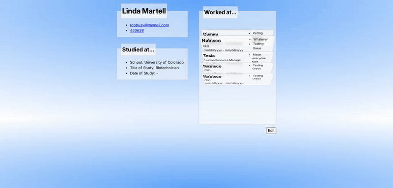
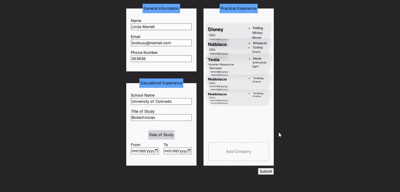

# CV Application Builder

This project is a CV Builder App, created as part of The Odin Project curriculum. It's designed to practice fundamental React concepts like props and state management. The application allows users to input their personal, educational, and professional information to generate a CV.

## Features

*   Create a professional CV by filling out a simple form.
*   Edit and update your information at any time.
*   Engaging and interactive user interface with animations.

## Showcase

### Display Mode



### Edit Mode



## Technologies Used

*   React
*   Vite
*   CSS

## Learning Journey

This project was an excellent opportunity to solidify my understanding of React's core concepts, particularly props and state. A significant part of my learning process was dedicated to implementing animations for the company cards.

Initially, I struggled with sequencing the animations. My first approach involved using an `animationend` event listener, but it proved to be unreliable and didn't align with React's declarative nature.

I then explored using `setInterval` to manage the animation sequence, but I encountered challenges with closures and stale state. This led me to a deeper understanding of how to work with intervals in React, thanks to the insightful article "[Making setInterval Declarative with React Hooks](https://overreacted.io/making-setinterval-declarative-with-react-hooks/)".

Ultimately, I opted for a simpler and more robust solution using `setTimeout`. This approach leverages React's re-rendering mechanism to ensure that the timeout always has access to the latest state, avoiding the complexities of closures and providing a clean and effective way to choreograph the animations.

## Getting Started

To get a local copy up and running, follow these simple steps.

### Prerequisites

*   npm
    ```sh
    npm install npm@latest -g
    ```

### Installation

1.  Clone the repo
    ```sh
    git clone https://github.com/your_username/your_project.git
    ```
2.  Install NPM packages
    ```sh
    npm install
    ```
3.  Run the development server
    ```sh
    npm run dev
    ```

## Live Demo

[Link to live demo]